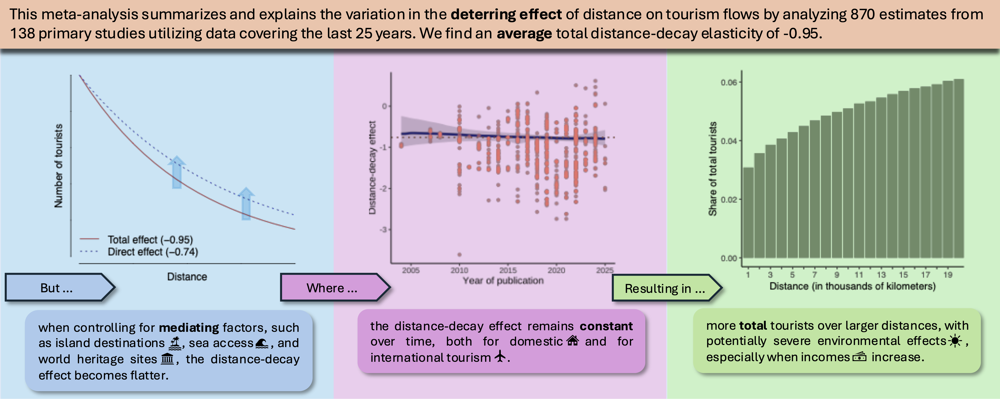
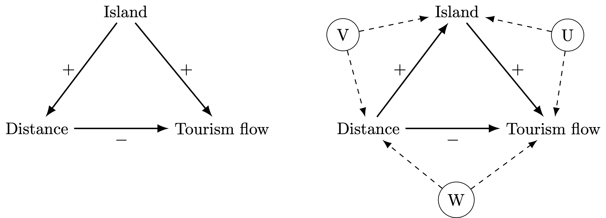
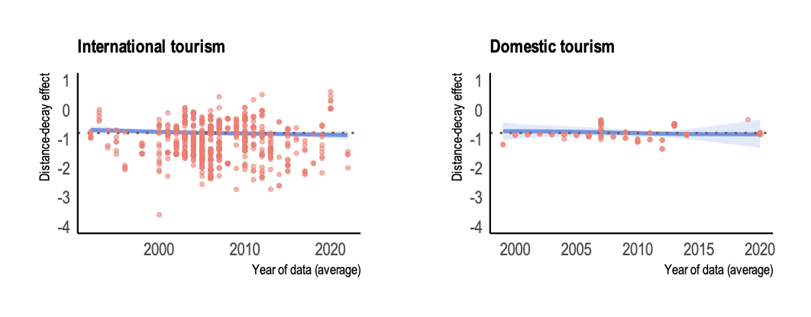

## Abstract

This meta-analysis summarizes and explains the variation in the deterring effect of distance on tourism flows by analyzing 870 estimates from 138 primary studies utilizing data covering the last 25 years. We find substantial heterogeneity among studies that mostly correlates with (unobserved) study characteristics, estimation methods, and locations of origin and destination included in the primary studies. We confirm previous findings that the mean total distance decay effect, using preferred methods and datastructures, is close to unit elasticity in absolute value (-0.93). However, when controlling for mediator variables, we find that the direct, physical, distance decay effect is significantly lower (-0.74). This distance decay effect is remarkably stable over the last 25 years and reveals a positive relation between distance and the total number of tourists.

## Graphical abstract

{width=100%}

## Main findings

We find a couple of interesting things. First of all, the 

{width=100%}

